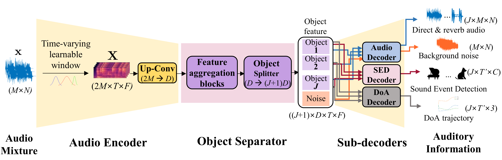

# DeepASA: An object-oriented multi-purpose network for auditory scene analysis


[](https://arxiv.org/pdf/2509.17247)
[](https://huggingface.co/datasets/donghoney22/ASA2_dataset)
[](https://huggingface.co/spaces/donghoney22/DeepASA)

Official implementation of **"[DeepASA: An object-oriented multi-purpose network for auditory scene analysis](https://arxiv.org/pdf/2509.17247) (NeurIPS 2025)"**.

*We propose DeepASA, a multi-purpose model for auditory scene analysis that performs multi-input multi-output (MIMO) source separation, dereverberation, sound event detection (SED), audio classification, and direction-of-arrival estimation (DoAE) within a unified framework.*



## 1. Setup
1. Clone repository
```
git clone https://github.com/donghoney0416/DeepASA.git
cd DeepASA
```

2. Install requirements
```
pip install -r requirements_.txt
```
We use FlashAttention and Mamba, so CUDA version must be > 11.6. If your CUDA version is less than 11.6, we recommand updating your NVIDIA driver first.

## 2. Details
### Dataset
We constructed a new dataset, Auditory Scene Analysis V2 (ASA2) dataset for multichannel USS and polyphonic audio classification tasks. The proposed dataset is designed to reflect various conditions, including moving sources with temporal onsets and offsets. For foreground sound sources, signals from 13 audio classes were selected from open-source databases (Pixabay, FSD50K, Librispeech, MUSDB18, Vocalsound). Specific information and how to download the dataset can be found at the hugging face link below.

[ASA2 dataset link](https://huggingface.co/datasets/donghoney22/ASA2_dataset)

### Training
You can train the DeepASA using the below command
```
python SharedTrainer.py fit --config=configs/DeepASA.yaml --configs/dataset/AuditorySceneAnalysis.yaml --data.batch_size=[2,2] --trainer.devices=[0,1,2,3] --trainer.max_epochs=100
```
[Pretrained ATST](https://drive.google.com/file/d/1X7sKLZo_RnoLHIK8vDlCpKOLXc7bjaRD/view?usp=sharing)

### Inference
You can evaluate the model you trained by appropriately modifying the code below
```
python SharedTrainer.py test --config=configs/logs/DeepASA/version_0/config.yaml --checkpoints=configs/logs/DeepASA/version_0/checkpoints/last.ckpt --data.batch_size=[2,2] --trainer.devices=[0,1,2,3]
```

## Citations
```
@article{lee2025deepasa,
  title={DeepASA: An object-oriented multi-purpose network for auditory scene analysis},
  author={Lee, Dongheon, Kwon Younghoo and Choi, Jung-Woo},
  journal={in Proc. Conference on Neural Information Processing Systems},
  year={2025}
}
```
